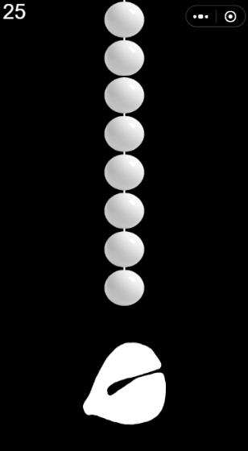
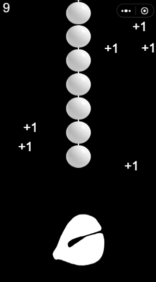
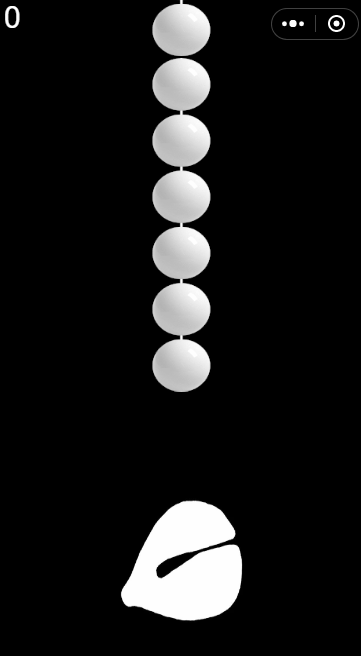

# 
 MuYu add 1

Mokugyo WeChat mini game program

 

Here is an [example](https://xn--4pv000j.online/).

## Table of Contents

- [ MuYu add 1](#-muyu-add-1)
  - [Table of Contents](#table-of-contents)
  - [Requirements](#requirements)
  - [Install](#install)
  - [Usage](#usage)
  - [Steps to Run](#steps-to-run)
  - [How to play](#how-to-play)
  - [Documentation](#documentation)
  - [License](#license)

## Requirements

- WeChat Mini Program Developer Tools, --> [guide](https://developers.weixin.qq.com/minigame/dev/guide/).

## Install

Clone to local directory:

`$ git clone https://github.com/junjielyu13/MuYu-add1.git`

## Usage

- Use the WeChat applet developer tool to open the [muyu](https://github.com/junjielyu13/MuYu-add1/tree/main/muyu) folder

- Compile with WeChat Mini Program Developer Tools

## Steps to Run

1. Use WeChat Mini Program Developer Tools to Play Games.
2. Or use the WeChat applet developer tool to compile it into the mobile phone to play the game.

## How to play

`"Click the Wooden fish or move the **Buddhist beads to accumulate merit for yourself!"` 

## Documentation

more documentation [here](https://developers.weixin.qq.com/minigame/dev/guide/).

## License

[MIT](https://github.com/junjielyu13/MuYu-add1/blob/main/LICENSE), [@All Contributors](#contributing).
